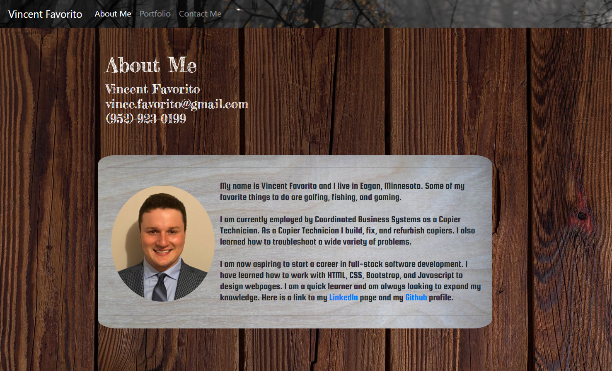
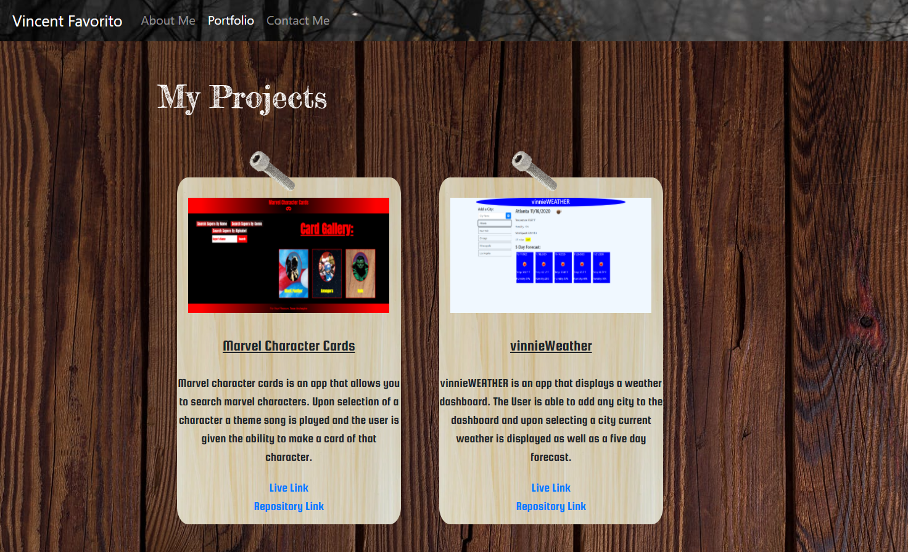
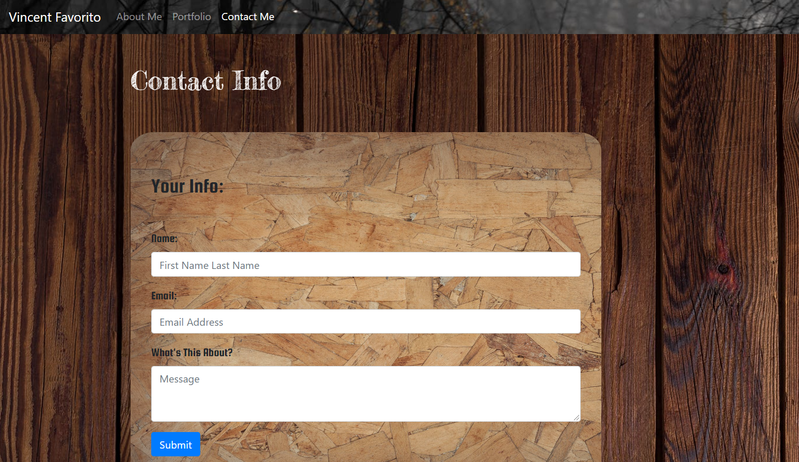

# Vincent Favorito's Portfolio

### Overview:
In this repository I created my own Responsive Portfolio.  What I mean by responsive is the portfolio will change its appearance based on the size of the screen of the device viewing it! This was primarily accomplished using HTML, CSS, Bootstrap, and jQuery.  The portfolio is made up of three seperate HTML pages that are linked to each other via a navbar on the top of the page.

## The Pages!
### Index:
      
### Portfolio:
       
### Contact:

    
### Example
Here is a link to the Portfolio:  [https://vfavorito.github.io/](https://vfavorito.github.io/)

### Installation
To install this project simply clone this repository to your local directory and access it using Visual Studio Code

### License
Copyright

Permission is hereby granted, free of charge, to any person obtaining a copy of this software and associated documentation files (the "Software"), to deal in the Software without restriction, including without limitation the rights to use, copy, modify, merge, publish, distribute, sublicense, and/or sell copies of the Software, and to permit persons to whom the Software is furnished to do so, subject to the following conditions:

The above copyright notice and this permission notice shall be included in all copies or substantial portions of the Software.

THE SOFTWARE IS PROVIDED "AS IS", WITHOUT WARRANTY OF ANY KIND, EXPRESS OR IMPLIED, INCLUDING BUT NOT LIMITED TO THE WARRANTIES OF MERCHANTABILITY, FITNESS FOR A PARTICULAR PURPOSE AND NONINFRINGEMENT. IN NO EVENT SHALL THE AUTHORS OR COPYRIGHT HOLDERS BE LIABLE FOR ANY CLAIM, DAMAGES OR OTHER LIABILITY, WHETHER IN AN ACTION OF CONTRACT, TORT OR OTHERWISE, ARISING FROM, OUT OF OR IN CONNECTION WITH THE SOFTWARE OR THE USE OR OTHER DEALINGS IN THE SOFTWARE.

