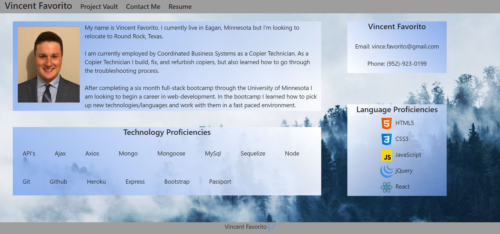

# Vincent's Portfolio

## Overview:
This is my Portfolio website.  It was created with React.  The website contains a short bio of myself, projects I have worked on, a contact me form, as well as my resume.  

### How it works!
Navigate through all the pages of my website with the navbar at the top!

### Home Page   
   

### Example
Here is a link to the Vincent's Portfolio:  [https://vfavorito.github.io/#/](https://vfavorito.github.io/#/)

### Contributing
If you would like to contribute to the development of this app the guidelines for doing so can be found here: [Contribution Covenant](https://www.contributor-covenant.org/version/2/0/code_of_conduct/code_of_conduct.txt)

### Questions?
Visit my Github profile here: [vfavorito](https://github.com/vfavorito) 
If you have any questions you can reach out to me at vince.favorito@gmail.com

### License
This App is covered under the MIT License